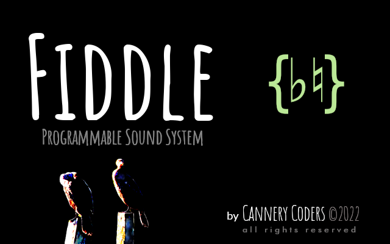

# FiddleSupport

A Place to Report Issues with Fiddle.

 

Fiddle is an integrated development environment (_IDE_) for 
[ChucK](https://chuck.princeton.edu).

The combination of Fiddle and ChucK represents an oddball, 
_programming-centric_, take on the idea of Digital Audio 
Workstation (_DAW_). 

Here's the [pitch](https://cannerycoders.com/#Fiddle).

